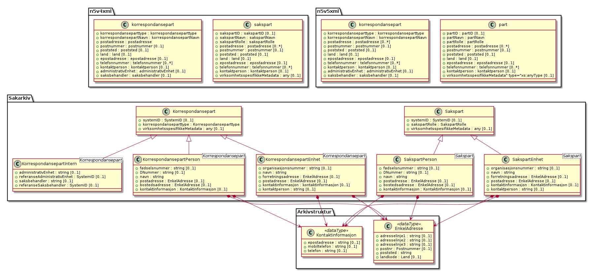

Avklare hvordan Sakspart og Korrespondansepart skal avleveres som n5v4 XML
==========================================================================

 ------------------  ---------------------------------
           Prosjekt  Noark 5 Tjenestegresesnitt
           Kategori  Versjon 1.0 beta
        Alvorlighet  protest
       Meldingstype  trenger klargjøring
    Brukerreferanse  pere@hungry.com
        Dokumentdel  n/a
         Sidenummer  n/a
        Linjenummer  n/a
    Innsendingsdato  2019-03-25
 ------------------  ---------------------------------

Denne teksten er del av en samling innspill til Noark5-standarden
tilgjengelig fra
[https://github.com/petterreinholdtsen/noark5-tester/](https://github.com/petterreinholdtsen/noark5-tester/).

Beskrivelse
-----------

Klassehierarkiet forankret i entitetene Sakspart og Korrespondansepart
har flere felt som ikke eksisterer i XML-skjema for Noark 5 versjon 4
og 5.  Dette gjør det uklart hvordan import fra XML og eksport til XML
for avlevering skal fungere.  Det må avklares hvordan informasjonen
registrert i arkivet via API-et skal la seg avlevere til arkivverket.

Se vedlagte UML-diagram som viser dagens entiteter i
API-spesifikasjonen og tilsvarende entiteter i XML-skjema for version
4 og 5.

Ønsket endring
--------------

Det er uklart hvordan dette best løses.  Enten må API-et nekte å ta
imot nyttig informasjon om organisasjonsnummer, d-nummer og
fødselsnummer for korrespondansepart, der det ikke finnes
virksomhetsspesifikkeMetadata som kan ta imot informasjonen.  Eller så
må korrespondansepart utvides i XML-skjema til å akseptere disse
feltene eller virksomhetsspesifikkeMetadata.  Jeg foretrekker den
siste løsningen.

Respons
-------

Ingen respons fra arkivverket så langt.

Også registrert som
https://github.com/arkivverket/noark5-tjenestegrensesnitt-standard/issues/80 .
